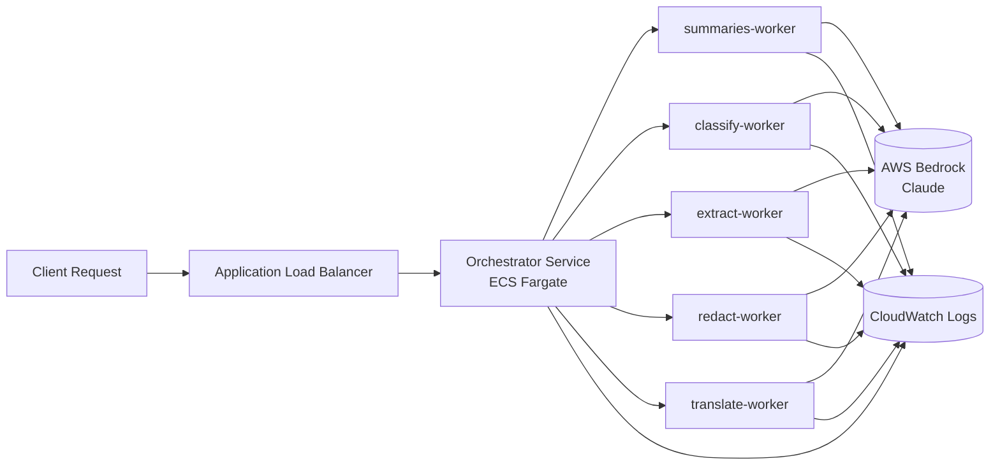
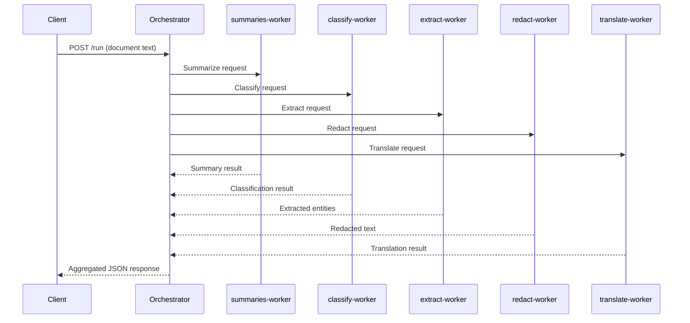
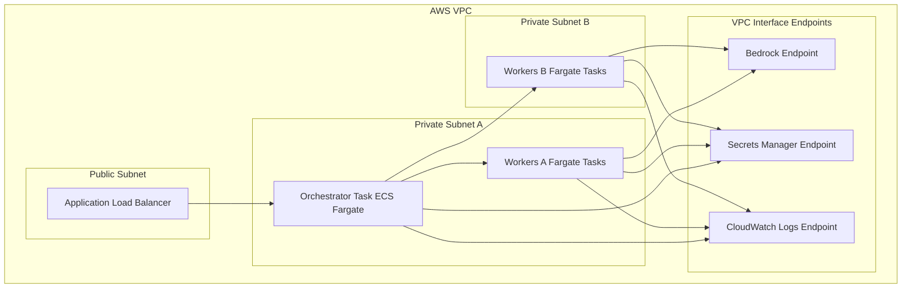
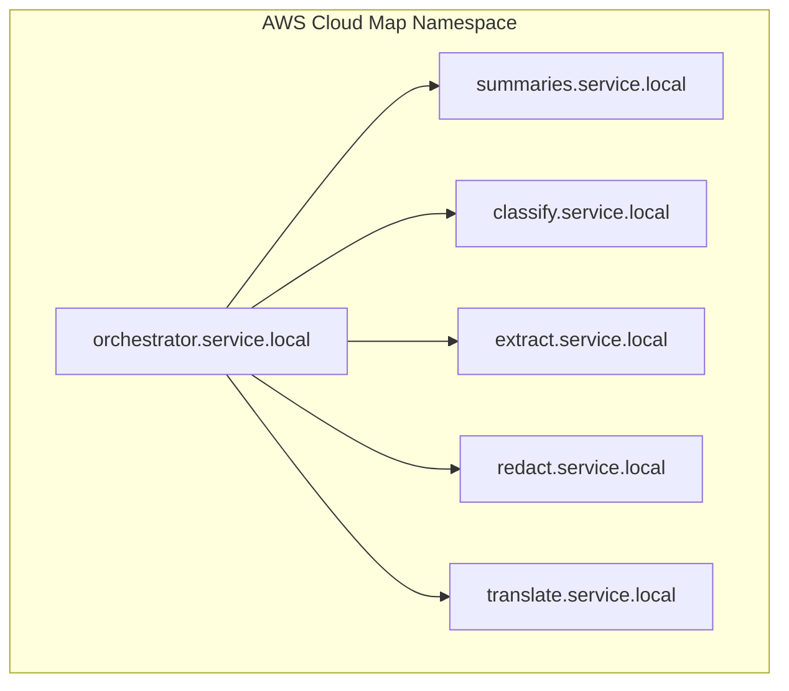
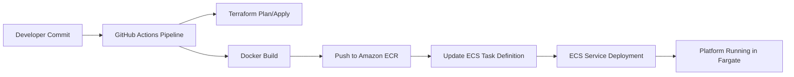

# AWS Bedrock Secure Agent Platform (Terraform)

A fully private, containerized multi‑agent AI platform running on **AWS ECS Fargate**, featuring an orchestrator that fans out requests to five specialized AI workers — all deployed through modular Terraform and integrated with **AWS Bedrock (Claude)** via VPC endpoints.

---

## **Architecture Overview**

### **High‑Level Architecture**


---

## **Sequence Flow (Orchestrator → Workers → Aggregation)**



---

## **Network Topology (VPC, Subnets, Endpoints)**



---

## **Service Discovery (AWS Cloud Map)**



---

## **CI/CD Pipeline (GitHub Actions → ECR → ECS)**



---

# **What This Is**
A secure, document‑intelligence platform built on AWS.  
Submit a document to the orchestrator → it distributes work in parallel across five workers → aggregates results → returns a single unified response.

### **Orchestrator**
- Receives inbound requests  
- Routes tasks to workers in parallel  
- Aggregates all worker outputs into one response  

### **Five Specialist Workers**
- **summaries-worker** — Summarizes long-form text  
- **classify-worker** — Classifies text against user‑provided labels  
- **extract-worker** — Extracts structured entities from documents  
- **redact-worker** — Redacts PII (SSN, email, phone, etc.)  
- **translate-worker** — Translates text into a target language  

---

# **Infrastructure Components**

### **Compute & Networking**
- ECS Fargate — Serverless container runtime  
- ECS Cluster + AWS Cloud Map — Private DNS‑based service discovery  
- AWS VPC — Private subnets, isolated workloads  
- VPC Interface Endpoint for Bedrock — All inference stays inside AWS  

### **Storage & Secrets**
- Amazon ECR — Private registry with image scanning  
- AWS Secrets Manager + KMS — Encrypted secrets with CMK  

### **Observability**
- Amazon CloudWatch Logs — Centralized logs for orchestrator and workers  

---

# **Security Hygiene**
This repository intentionally excludes:  
- `terraform.tfvars`  
- `terraform.tfstate`  
- `.terraform/` provider binaries  

Additional security posture:
- Bedrock accessed **only** through a VPC endpoint  
- ECS tasks authenticate using **IAM Task Roles**  
- All inter‑service communication occurs over private subnets  

---

# **Prerequisites**
- AWS CLI  
- Terraform v1.7.0+  
- Docker Desktop  
- Bedrock model access approved  
- IAM permissions for ECR, ECS, Bedrock, Secrets Manager, KMS, VPC, CloudWatch Logs, IAM  

---

# **Deployment**

### Step 1 — Configure Variables
```bash
cp terraform.tfvars.example terraform.tfvars
```

### Step 2 — Deploy Infrastructure
```bash
terraform init
terraform plan
terraform apply
```

### Step 3 — Build and Push Images

**Windows (PowerShell):**
```powershell
$token = aws ecr get-login-password --region <region>
docker login --username AWS --password $token <account-id>.dkr.ecr.<region>.amazonaws.com
.\build-and-push.ps1
```

**Linux / Mac:**
```bash
aws ecr get-login-password --region <region> | docker login --username AWS --password-stdin <account-id>.dkr.ecr.<region>.amazonaws.com
./build-and-push.ps1
```

### Step 4 — Test the Platform
```bash
curl -X POST http://<orchestrator-endpoint>/run \
  -H "Content-Type: application/json" \
  -d '{"text": "Your document text here"}'
```
---

# **API Reference**

| Method | Endpoint | Description |
|--------|----------|-------------|
| `GET` | `/health` | Health check — returns `200 OK` when the service is up |
| `POST` | `/run` | Fan-out to all 5 workers in parallel, returns aggregated results |
| `POST` | `/summarize` | Summarize long-form text |
| `POST` | `/classify` | Classify text against provided labels |
| `POST` | `/extract` | Extract structured entities from a document |
| `POST` | `/redact` | Redact PII (SSN, email, phone, etc.) |
| `POST` | `/translate` | Translate text to a target language |

All `POST` endpoints accept `application/json` with a `text` field (and optionally `target_language` for `/translate`, `labels` for `/classify`).

---

# **Next Steps / Production Hardening**

- **HTTPS / TLS** — Provision a certificate in [AWS Certificate Manager](https://console.aws.amazon.com/acm), attach it to the ALB, add an HTTPS listener on port 443, and redirect port 80 → 443
- **Custom domain** — Create a Route 53 hosted zone, add an A-record alias pointing to the ALB DNS name, and reference it in your ACM certificate
- **CI/CD pipeline** — Wire GitHub Actions (or AWS CodePipeline) to build and push images to ECR on merge to `main`, then trigger an ECS rolling deployment via `aws ecs update-service --force-new-deployment`
- **Production IAM hardening** — Replace broad managed policies with least-privilege inline policies scoped to specific ECR repositories, ECS clusters, and Secrets Manager ARNs; enable IAM Access Analyzer to surface over-permissioned roles

---

# **Author**

**Joshua Phillis**  
Retired Army National Guard Major | Cloud & Platform Engineer  
GitHub: **@joshphillis**
